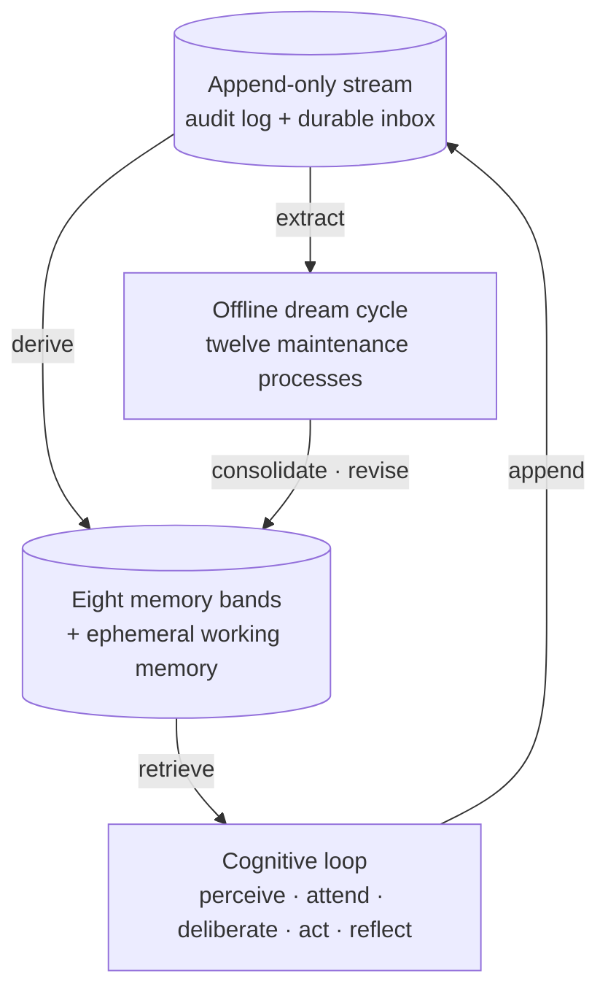

<div align="center">

# Borg

**Cognitive memory architecture for autonomous AI beings.**

A TypeScript library, CLI, and optional headless daemon for agents with
persistent memory, an explicit cognitive loop, and an identity that evolves
over time.


</div>

---

Borg is a memory substrate for agents that are meant to last -- to accumulate
experience, form beliefs, keep promises, and grow an identity across thousands
of conversations.

Not a vector store bolted onto a chat loop. Borg starts from an append-only
stream of everything that happens, derives eight typed memory bands from it,
runs an explicit cognitive loop that consults them before it speaks, and runs
an offline *dream cycle* that consolidates and revises what was learned while no
one is waiting.

One principle runs through all of it: **the model handles language and
judgment; the harness manages information and validates structure.** Borg never
polices what the model says, and never hides a memory from it to enforce privacy
-- it recalls broadly, labels what is private, and lets the model decide what to
disclose.



## How it works

### The stream

One append-only, chronological log of everything the agent experiences --
messages, perceptions, thoughts, tool calls, internal events, dream reports.
Every derived memory traces back to the entries that justify it, so the answer
to "where did this come from?" always bottoms out at a concrete id.

The stream is also the inbox. Inbound messages are durably enqueued and
acknowledged *before* any turn runs; a catch-up worker then coalesces the
backlog into a single turn. The agent can sit behind a real chat transport
without blocking the sender on a multi-second turn, and a crash never drops or
double-answers a message.

### Memory bands

Derived state lives in eight typed bands plus an ephemeral per-turn scratchpad.
Each answers a different question:

| Band | What it holds |
|------|---------------|
| **Episodic** | what happened -- events and the turns that produced them |
| **Semantic** | what it knows -- beliefs as a typed, walkable graph |
| **Procedural** | how it does things -- skills as Beta(α, β) posteriors, picked by Thompson sampling |
| **Affective** | how it felt and feels -- mood tracked over time |
| **Self** | values, goals, traits, autobiographical arc, open questions |
| **Commitments** | scoped promises, surfaced before the agent speaks |
| **Social** | per-person trust and interaction history |
| **Relational slot** | evidence-backed relationship facts (kinship and the like) |
| **Working** | ephemeral, per-turn -- gone when the turn ends |

Authoritative state is plain rows in SQLite; vectors in LanceDB make it
retrievable. The stream is the audit trail, not the source of truth.

### The cognitive loop

Every turn runs the same explicit pipeline -- **perceive → attend → deliberate
→ act → reflect** -- with System 1 / System 2 branching and the internal
monologue persisted as stream entries.

Retrieval is graph-aware: typed edges (`supports`, `contradicts`, `causes`,
`is_a`, ...) are walked during lookup, weights shift with the conversational
mode (problem-solving, relational, reflective, idle), and ranking turns
mood-congruent when mood is non-neutral.

Commitments are injected into the prompt as context, not bolted on as a filter
-- the agent knows its promises before it speaks. A post-hoc check with revision
catches real violations without misfiring on compliant refusals.

Several newer pieces are load-bearing: the Evidence Ledger turns retrieved
records into cited prompt evidence; Shared State keeps compact durable audience
state across turns; the prompt-surface registry pins fixture-backed prompt
contracts; `callStructuredTool` centralizes structured LLM tool calls; and the
observability taxonomy keeps trace names stable while old persisted traces stay
readable.

> The full turn lifecycle -- catch-up, audience resolution, perception,
> retrieval, evidence ledger, deliberation, guards, reflection -- is documented
> in [ARCHITECTURE.md](ARCHITECTURE.md).

### The dream cycle

Between turns, twelve offline processes maintain and revise the substrate:
consolidation, reflection, semantic extraction, curation, oversight, review
resolution, rumination, self-narration, procedural synthesis, belief revision,
creator-directive reconciliation, and commitment reconciliation. Each runs
with plan/apply parity and budget caps, writes to an append-only audit log, and
is reversible wherever a reverser is registered.

Scheduled offline enablement is controlled by `maintenance.lightProcesses` and
`maintenance.heavyProcesses`; remove a process from both lists to disable it.

## Quickstart

```bash
pnpm install
pnpm build
```

```ts
import { Borg } from "borg";

const borg = await Borg.open();

const { response } = await borg.turn({
  userMessage: "I take my coffee black -- remember that.",
  audience: "participant",
});

console.log(response);

await borg.close();
```

That single call perceives the message, retrieves what's relevant, deliberates,
emits one reply, and reflects -- writing back whatever it learned. Next time
that participant asks, the preference is already in episodic and semantic memory.

<details>
<summary><b>More of the library surface</b></summary>

```ts
// durable async ingest (stream-as-inbox): enqueue + ack without running a
// turn; borg.inbox.catchUp drains the backlog into coalesced turns
await borg.enqueueMessage({
  userMessage: "...",
  senderEntityId,
  session: { /* SessionEnsureInput + source_external_id */ },
  sourceMessageKey, // transport-level dedup key
});

// memory access
await borg.episodic.search("coffee preferences", { limit: 5 });
await borg.self.goals.add({
  description: "ship the retrieval rewrite",
  priority: 0.5,
  provenance: { kind: "manual" },
});
await borg.skills.select("debugging pgvector similarity");
await borg.mood.current(sessionId);
await borg.social.getProfile("participant");

// offline maintenance (the dream runner is itself callable; .plan / .apply /
// per-process helpers hang off it)
await borg.dream({ processes: ["consolidator", "reflector"] });
```

</details>

## CLI

The same surface is available from the command line -- stream, memory bands,
retrieval, the dream cycle, autonomy, and more.

```bash
borg turn "what did I tell you about my coffee?" --audience participant
borg episode search "coffee" --since 1h
borg dream --dry-run
```

<details>
<summary><b>Full command reference</b></summary>

```
borg version
borg config show
borg auth status|refresh

borg stream tail [--n 20] [--session <id>]
borg stream append --kind <kind> --content <text>

borg episode search <query> [--limit] [--since <rel>]
borg episode show <id>
borg episode extract [--since 1h]

borg goal add|list|done|block|progress
borg value add|list|affirm
borg trait show

borg turn "<message>" [--session] [--audience] [--stakes low|medium|high]
borg workmem show|clear [--session]

borg semantic node add|show|search|list
borg semantic edge add|list|invalidate
borg semantic walk <node-id> [--depth 2]
borg commitment add|list|revoke [--audience]
borg review list|resolve
borg correction forget|why|correct|about-me|events

borg dream [--process <names>] [--dry-run] [--budget N] [--output plan.json]
borg dream {consolidate,reflect,curate,oversee,ruminate,narrate} [--dry-run]
borg dream ruminate [--max-questions N]
borg dream apply --plan plan.json
borg audit list|revert
borg maintenance tick [--cadence light|heavy]
borg trace inspect <path>

borg period current|list|open|close|show
borg growth list|add
borg question list|add|resolve|abandon|bump

borg skill add|list|show|select
borg mood current|history
borg social profile|upsert|adjust-trust
```

</details>

## Requirements

- **Node >= 22.**
- **An OpenAI-compatible embeddings endpoint.** Defaults to LM Studio on
  `localhost:1234` with `text-embedding-qwen3-embedding-8b` (4096 dims).
- **Anthropic credentials.** `anthropic.auth` defaults to `auto`: it uses
  `ANTHROPIC_API_KEY` when present and otherwise falls back to a Claude Code
  OAuth token (`ANTHROPIC_AUTH_TOKEN`, then the shared credentials file). Pin
  either side with `BORG_ANTHROPIC_AUTH=api-key|oauth`; run `borg auth status`
  to see what resolves.

The being's cognition targets **Opus 4.8**. Background and extraction remain
on Opus 5. The substrate co-produces identity with the cognition model, so the
design accepts drift when migrating to a successor rather than chasing
model-swap conformance.

## Development

```bash
pnpm test         # run once
pnpm test:watch   # watch mode
pnpm typecheck    # tsc --noEmit
pnpm build        # tsup -> dist/
pnpm dev          # tsx watch on the CLI
pnpm format       # prettier
```

`pnpm chat` runs `scripts/chat.ts`, a developer-only interactive helper for
local sessions. It is not part of the shipped `borg` CLI.

## Status

> [!WARNING]
> Under active development and already exercised in a live long-running
> deployment. No stability guarantees -- schemas, storage layout, and the
> public API may still shift as the library is hardened.

## License

Unlicensed personal project. Ask before reusing substantively.
